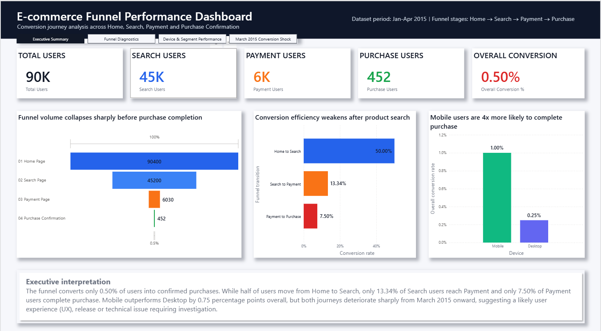
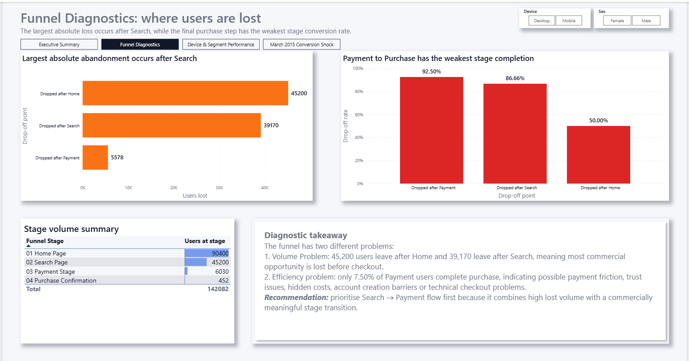
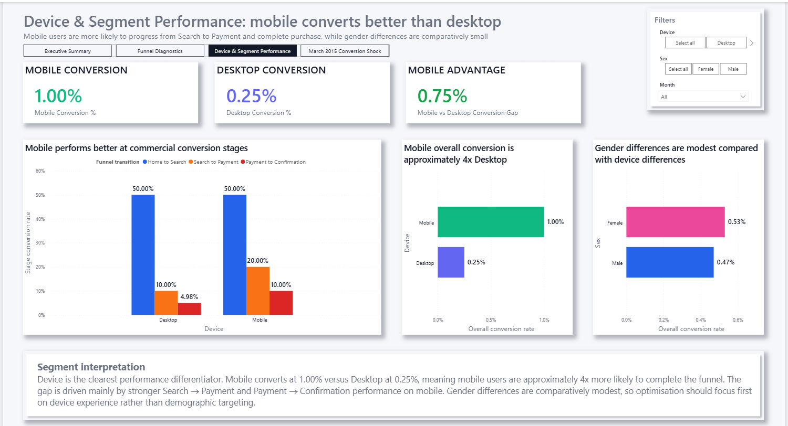
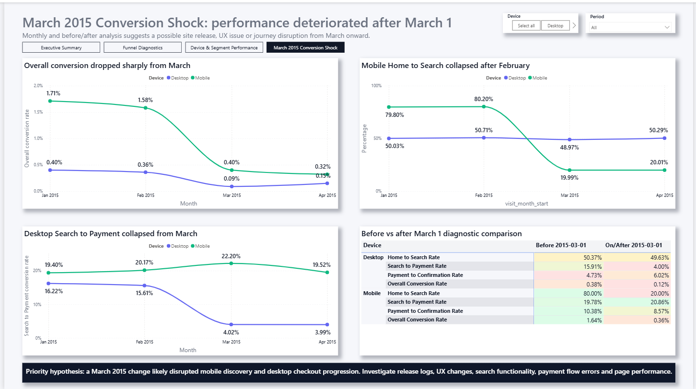

# E-commerce Funnel Analysis | SQL Server + Power BI

## Project Links
- **Portfolio case study:** https://georgeoduk.github.io/ecommerce-funnel.html
- **GitHub repository:** https://github.com/GeorgeOduk/ecommerce-funnel-analysis-sql-powerbi

## Project Overview

This project analyses an e-commerce conversion funnel to understand how users move through the journey from landing on the home page to completing a purchase.

The funnel stages are:

**Home Page - Search Page - Payment Page - Purchase Confirmation**

The objective was to identify where users drop off, compare conversion performance by segment, diagnose time-based performance changes, and recommend business actions to improve conversion.

---

## Business Questions

This analysis answers five key business questions:

1. How many users reach each stage of the funnel?
2. Where does the largest drop-off occur?
3. Do mobile and desktop users behave differently?
4. Are there meaningful differences by sex?
5. Did funnel performance change over time?

---

## Tools Used

- SQL Server
- SQL Server Management Studio
- T-SQL
- Power BI
- GitHub
- Markdown

---

## Dashboard Preview

### Executive Summary



### Funnel Diagnostics



### Device & Segment Performance



### March 2015 Conversion Shock



---

## Key Results

| Funnel Stage | Users |
|---|---:|
| Home Page | 90,400 |
| Search Page | 45,200 |
| Payment Stage | 6,030 |
| Purchase Confirmation | 452 |

| Conversion Step | Conversion Rate |
|---|---:|
| Home - Search | 50.00% |
| Search - Payment | 13.34% |
| Payment - Purchase | 7.50% |
| Overall Conversion | 0.50% |

---

## Key Insights

### 1. The funnel has a major conversion challenge

Only **0.50%** of users complete the full funnel from Home Page to Purchase Confirmation.

### 2. The largest absolute loss occurs before checkout

The business loses:

- **45,200 users** after the Home Page
- **39,170 users** after the Search Page
- **5,578 users** after the Payment Page

This shows that the business has a major pre-checkout engagement and progression problem.

### 3. Payment completion is the weakest efficiency stage

Only **7.50%** of users who reach Payment complete purchase. This suggests possible checkout friction, trust issues, payment errors, hidden costs, or form complexity.

### 4. Mobile users outperform desktop users

Mobile users convert at **1.00%**, compared with **0.25%** for Desktop users. This means Mobile users are approximately **4x more likely** to complete the full funnel.

### 5. Funnel performance deteriorates sharply from March 2015

The strongest diagnostic finding is the March 2015 deterioration:

- Mobile Home - Search falls from approximately **80%** before March to **20%** after March.
- Desktop Search - Payment falls from approximately **15.91%** before March to **4.00%** after March.

This suggests a possible product release, user experience "(UX)" issue, technical disruption, tracking issue, or journey change from March onward.

---

## Business Recommendations

Based on the analysis, the business should:

1. Audit March 2015 product releases, UX changes, tracking changes, and technical issues.
2. Investigate why Mobile Home - Search conversion dropped sharply after February.
3. Review the Desktop Search - Payment journey for friction or checkout blockers.
4. Improve Search - Payment progression through clearer CTAs, better product discovery, and reduced journey friction.
5. Investigate Payment - Purchase abandonment, including hidden costs, form complexity, payment errors, and trust signals.
6. Run A/B tests on product search, payment page design, and checkout progression.

---

## SQL Skills Demonstrated

- Data import workflow
- Data cleaning
- Staging tables
- SQL views
- Joins
- CASE statements
- Aggregate functions
- CTEs
- Conversion rate calculations
- Date-based analysis
- Segmentation analysis
- Drop-off analysis

---

## Power BI Skills Demonstrated

- Data model connection to SQL Server
- Dashboard page design
- KPI cards
- Funnel charts
- Bar and column charts
- Line charts
- Matrix visuals
- Slicers
- Conditional formatting
- Executive insight text boxes
- Commercial dashboard storytelling

---

## Repository Structure

```text
ecommerce-funnel-analysis-sql-powerbi/
│
├── README.md
├── sql/
├── powerbi/
├── images/
├── docs/
└── data/
